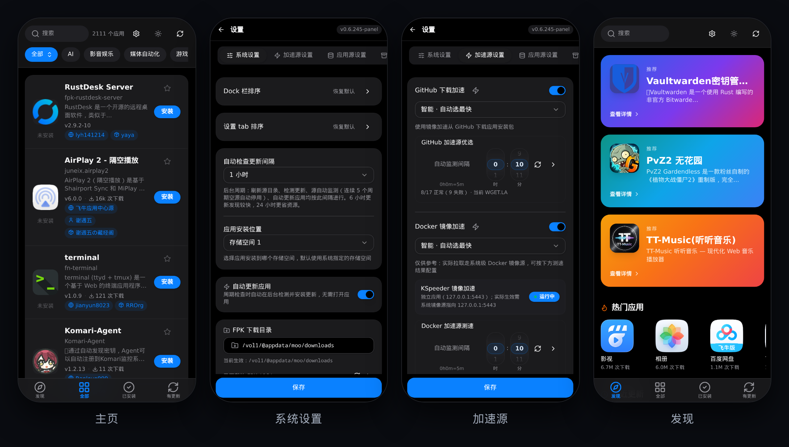
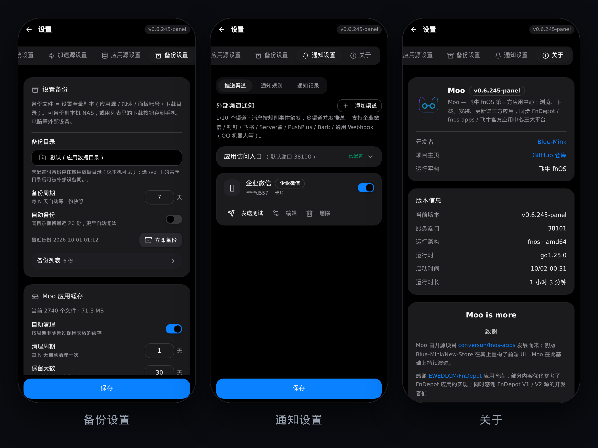
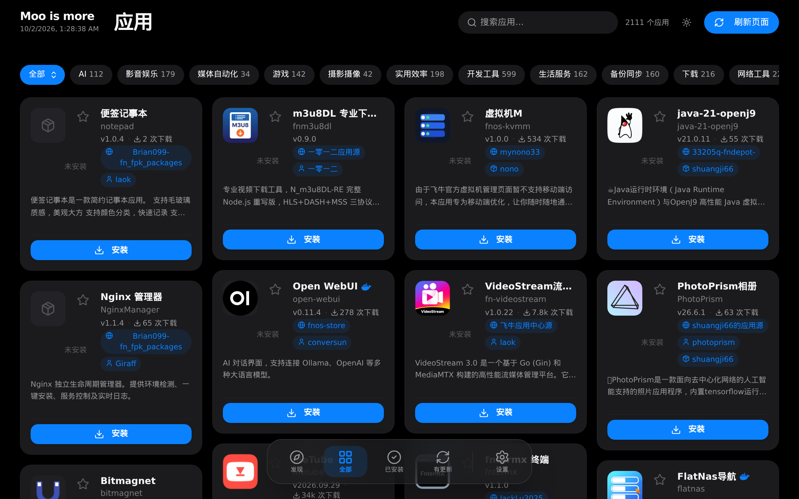
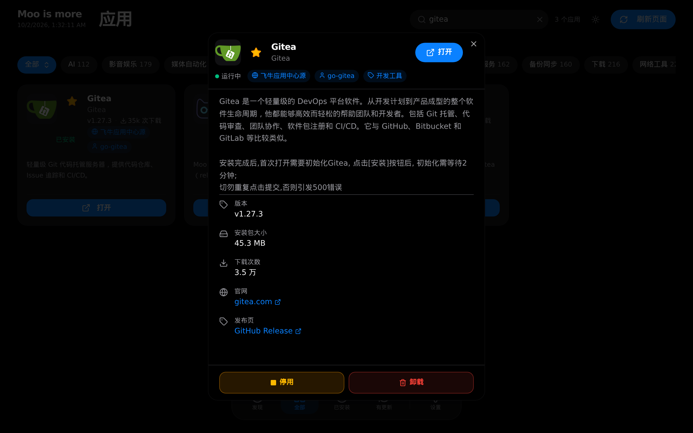
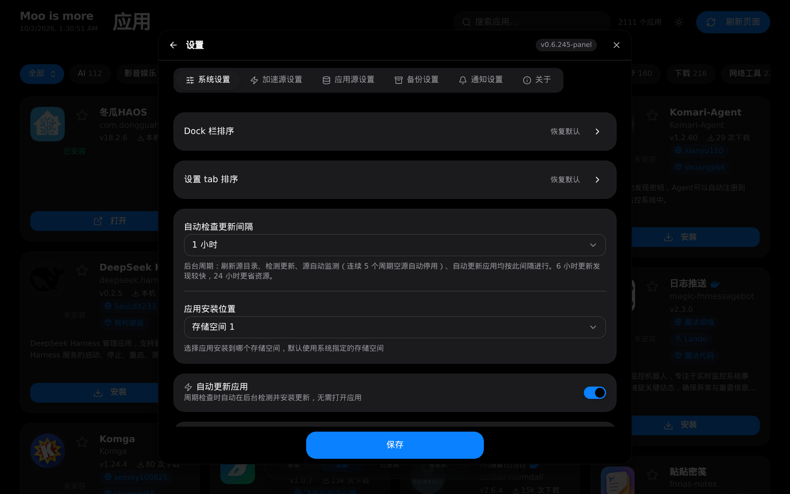

<p align="center">
  <br/>
</p>

<h1 align="center">For fnOS<br/>Moo is more</h1>

<p align="center">
  在飞牛 NAS 上装一个第三方应用中心，1800+ 应用浏览 / 安装 / 更新 / 下载，通知推送开箱即用
</p>

<p align="center">
  <a href="releases/latest"></a>
  
  
  <a href="LICENSE"></a>
</p>

<p align="center">
  <a href="releases/latest">下载 FPK</a> ·
  <a href="releases">更新日志</a> ·
  <a href="https://github.com/conversun/fnos-apps">fnos-apps（上游）</a> ·
  <a href="https://github.com/Blue-Mink/moo/issues">反馈问题</a>
</p>

本仓库包含 Moo 的全部源码：Go 后端（单二进制，web embed）+ React / TypeScript 前端（Vite 构建后内嵌），发布产物为仅 x86_64 的单 FPK。应用目录数据来自三大平台——飞牛官方应用中心、FnDepot、fnos-apps（conversun），Moo 只负责聚合、归类与推送，不修改上游数据。仓库根部的 `moo.json` 是自索引——**本仓库本身就是一个 Moo 应用源**（见下方「作为 Moo 应用源」）。

<p align="center">
  <br/>
  <b>移动端 · 主页 / 收藏 / 发现（暗黑模式）</b><br/>
  App Store 风格列表 · 搜索可直接贴源链接 · 收藏与关注源
</p>

<p align="center">
  <br/>
  <b>移动端 · 设置全 tab</b><br/>
  加速源健康自动监测 · 应用源 157 个一键恢复 · 通知内容三档
</p>

<p align="center">
  <br/>
  <b>桌面端 · 主页</b><br/>
  14 个领域分类 chip · 应用网格 · 批量操作与拖拽排序
</p>

<table>
  <tr>
    <td width="50%" align="center"></td>
    <td width="50%" align="center"></td>
  </tr>
  <tr>
    <td align="center"><b>应用详情</b></td>
    <td align="center"><b>设置</b></td>
  </tr>
</table>

## 安装

| # | 做什么 | 说明 |
| --- | --- | --- |
| 1 | [下载 FPK](releases/latest) | 当前 `0.6.278` · SHA256 `f1f091180f5d01996c274f98dd116678a68a8b483b64dd9afaad439b5c67b1ca` |
| 2 | 应用中心 → 手动安装 | 向导可选 Web 端口（默认 `38100`） |
| 3 | 面板打开 `/app/moo/` | 统一网关入口，继承面板登录 + 仅管理员 |
| 4 | （可选）配置推送渠道 | 设置 → 通知设置：企业微信 / 钉钉 / 飞书等 7 种外部渠道 |

运行要求：fnOS x86_64。无其他依赖——后端 Go 单二进制（web embed），前端构建后内嵌，整包约 7.8 MB。

> [!TIP]
> 装完可应用内自更新：版本号红点 + 确认框，走平台升级通道就地更新，`@appdata` 数据保留。

## 作为 Moo 应用源

仓库根部的 `moo.json` 是按 [Moo 应用源协议](docs/MOO-PROTOCOL.md) 生成的自索引（当前收录最近 3 个版本，下载链接指向本仓库 releases，含 SHA256）。在 Moo 中添加本仓库作为源：

- 搜索框直接粘贴 `https://github.com/Blue-Mink/moo` → 自动识别为源
- 或 设置 → 应用源 → 添加源：仓库地址 / raw 直链（`…/raw/main/moo.json`）均可

这也是协议的最小可用示例源；字段规范、多版本与 `packages` 结构、版本比较规则见 [docs/MOO-PROTOCOL.md](docs/MOO-PROTOCOL.md)。

## 为什么这样设计

| 能力 | 说明 |
| --- | --- |
| 三源同步 | 飞牛官方应用中心 · FnDepot（V1/V2）· fnos-apps；内置 157 个社区源，一键恢复 / 去重 / 重命名 / 拖拽排序 |
| 智能归类 | 14 个领域分类：精选表优先 → 标签映射 → 关键词兜底，官方口径对齐 |
| 通知体系 | 30+ 事件 × 7 外部渠道，内容三档 × 形式按渠道可选；应用内通知恒开、永不漏记 |
| GitHub 加速 | 多镜像测速自动优选，自更新 / FPK 下载 / 源同步全链路走加速；全挂告警 + 恢复通知 |
| 应用内自更新 | 平台升级通道就地更新，`@appdata` 数据保留；版本号红点 + 确认框 |
| 收藏与关注 | 应用收藏、关注源（新增应用推送 + 关注源报表）、忽略更新（列表可找回） |
| 搜索贴源 | 搜索框直接粘贴 GitHub / FnDepot 源地址，自动识别源并搜索其应用 |
| 备份与缓存 | 配置快照一键备份 / 周期自动备份；已下载 FPK 缓存自动清理 |
| 下载中心 | aria2 高速下载 + 断点续传，任务状态全透明、可暂停 / 删除 |

## 工作原理


**一句话总结**：后端只监听回环地址，面板网关是唯一入口——继承面板登录态、仅管理员可见，不额外暴露任何公网端口。

## 通知体系

- **事件**：应用生命周期（安装 / 更新 / 卸载 / 下载 × 成功失败）、应用更新摘要、关注源变化、加速源切换 / 全挂、自身健康与资源告警、备份完成……共 30+ 类，逐条开关 + 手动触发
- **渠道**：企业微信（卡片 / 富文本表格 / 经典 markdown）· 钉钉 · 飞书 · Server酱 · PushPlus · Bark · 通用 Webhook
- **内容**：简洁（关键信息）/ 友好（关键摘要 + 折叠）/ 完整（全部信息），渠道测试即发欢迎语

## 端口与入口

| 项 | 值 | 说明 |
| --- | --- | --- |
| Web 端口 | `38100`（向导可改） | 后端仅监听回环，不直接对外 |
| 面板入口 | `/app/moo/` | 唯一入口，走面板统一网关 |

> [!NOTE]
> 入口继承面板登录 + 仅管理员，因此跨设备访问需先有面板的远程访问（如 FN Connect）。

## 仓库结构

```
cmd/          daemon 入口
internal/     后端：目录构建 / 源管理 / 通知 / 加速 / 自更新 / API
frontend/     前端：React + TypeScript（Vite）
fnos/         FPK manifest 与生命周期脚本
docs/         文档（API / 应用源协议 / 设计记录）与 README 配图
skills/       Agent Skills：使用与诊断（moo/）、构建并发布到 Moo（fpk-build-to-moo/）
```

## 从源码构建

```bash
./build.sh x86    # 产出 moo_<version>_x86.fpk（首次自动下载 fnpack）
go test ./...     # 单元测试
```

## 文档与技能

| 资源 | 说明 |
|---|---|
| [API 文档](docs/API.md) | 全部 HTTP 端点、请求/响应字段、SSE 事件、鉴权与错误码 |
| [应用源协议](docs/MOO-PROTOCOL.md) | `moo.json` 完整规范：字段全表、14 项固定分类、多版本与 `packages`、版本比较规则、7 份带注释示例、FAQ |
| [使用与诊断技能](skills/moo/) | Agent Skill：四平面核心模型、完整 API 镜像、安装与热替换、安全规则、排障 |
| [构建并发布到 Moo 技能](skills/fpk-build-to-moo/) | Agent Skill：**从构建 FPK 到发布 Moo 的全流程**——构建与本地验证 → 写 `moo.json` → 放仓库（匿名可达）→ 搜索框自测 → 添加为源与详情页验收 → 版本迭代与发布脱敏 |
| [发布到 FnDepot 技能](https://github.com/Blue-Mink/fpk-build-to-fndepot-skill) | Agent Skill：FnDepot V2 协议与上架流程 |
| [FPK 构建技能](https://github.com/Blue-Mink/fn-fpk-builder-skill) | Agent Skill：FPK 打包 / 校验 / 发布 / SSH 部署与排障 |

> 后两个为独立仓库的技能，克隆到工作区的 `skills/` 目录即可被 Agent 识别；
> 前两个已随本仓库分发（见 [`skills/`](skills/)）。

## 📄 许可证

[MIT License](LICENSE) · © 2026 Blue-Mink

---

## 🙏 致谢

- [conversun/fnos-apps](https://github.com/conversun/fnos-apps) —— 第三方应用目录数据源，Moo 由其发展而来
- [FnDepot](https://github.com/EWEDLCM/FnDepot) 及其源开发者们 —— 第三方应用源生态
- [fn-knock](https://github.com/Blue-Mink/fn-knock-turborepo) —— 通知事件中心模型与 UI 参考
- [飞牛 fnOS](https://www.fnnas.com/) —— 友好的 NAS 操作系统
- AI 模型 —— 开发全程协作伙伴

---

<div align="center">

**如果觉得好用，顺手点个 ⭐ Star 支持一下！**

Made with ❤️ by [Blue-Mink](https://github.com/Blue-Mink)

</div>
