# Moo —— 飞牛 fnOS 上的第三方应用商店：三源合一，2100+ 应用一个中心搞定

给大家介绍一下我自己做（维护）的飞牛第三方应用中心 —— **Moo**。

一句话说明白它是干嘛的：**把「飞牛官方应用中心 + FnDepot 开源商店 + fnos-apps 社区仓库」三个生态的第三方应用，合并进同一个商店里浏览、搜索、安装、更新、推送通知**。当前版本 v0.6.311，已收录 **157 个应用源、2100+ 应用**，全部在你 NAS 本机管理和缓存。

> 项目开源（MIT）：GitHub `Blue-Mink/moo`
> 安装方式：下载 `.fpk`（x86 / arm 双架构）手动安装，或在别的已装 Moo 里搜索 moo 直接自更新

## 为什么需要它

飞牛官方应用中心很好，但第三方应用散落在各种地方：

- FnDepot 开源商店要装 FnDepot 客户端
- 大量作者只把 FPK 发在 GitHub Release
- 想升级某应用，得自己记得版本、自己找仓库、自己下载 FPK

Moo 把这些全部收进来：**加一个仓库链接就是一个源**，之后所有应用跟官方商店一样有统一目录、统一搜索、统一更新提醒，还带多源比对——同一个应用出现在多个源时自动合并，取最高版本做更新判定。

## 功能总览

| 模块 | 干什么 |
|:--|:--|
| 发现 | 推荐位、热门应用、最近更新、收藏列表 |
| 全部应用 | 全量目录：搜索 / 14 类自动归类 / 排序 / 多源合并卡片 |
| 已安装 | 本机已装应用管理与状态 |
| 有更新 | 自动巡检所有源，集中展示可更新应用 |
| 应用详情 | 预览图、README、更新日志、安装/打开/停用/卸载/下载 FPK |
| 安装向导 | 适配 FPK 向导参数（自定义端口、同意协议等） |
| 设置 | 系统 / 加速源 / 应用源 / 备份 / 通知 / 日志 / 关于 七个 tab |
| 通知推送 | 7 类渠道（企微/钉钉/飞书/Server酱/PushPlus/Bark/Webhook）×事件规则 |
| Moo 源协议 | 开放的 moo.json 协议，任何 GitHub 仓库都能一键变成应用源 |

---

## 一、安装与打开

1. 到 GitHub Releases 下载最新 `moo_0.6.x_x86.fpk`（arm 设备选 `moo_0.6.x_arm.fpk`）；
2. 飞牛「应用中心 → 手动安装」上传，安装过程会出现 Moo 自己的**首次配置向导**：开源许可确认 → 访问端口（默认 `38100`）→ 下载目录与日志路径（均可默认）；
3. 装完桌面出现 **Moo 图标**，从桌面点开就是完整界面。

> ⚠️ 一个设计点先说在前面：直接输 `http://NAS_IP:38100` 也能打开页面，但**管理类操作请从飞牛桌面图标进入**。裸端口是调试入口，出于安全设计不接受管理员操作（会提示需通过面板网关），桌面图标走飞牛登录态，零配置就是管理员，这是特性不是 bug 😄

---

## 二、界面总览：Dock 栏五键

界面是响应式的（手机 / 平板 / PC 浏览器都适配），底部 Dock 就五个按钮，所有功能从这里出发：

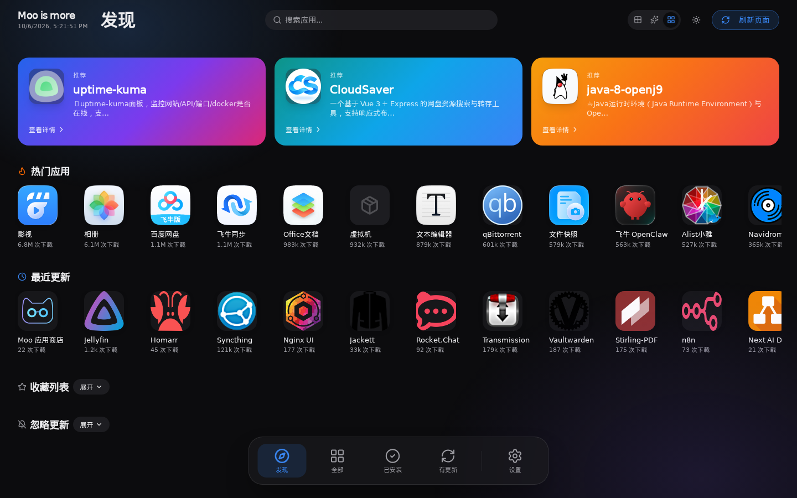

- **发现**：进店大门。顶部横向**推荐位**大卡，下面是**热门应用**（带官方下载量）和**最近更新**（哪个应用刚发新版一眼看到），底部还有可折叠的**收藏列表**；
- **全部**：全量应用目录（下面细讲）；
- **已安装**：只看本机装了的；
- **有更新**：全源巡检结果，**Dock 图标带红点/角标**就是有新版本在等你；
- **设置**：七个 tab（下面细讲）。

整体视觉是**毛玻璃 + 胶囊**语言：磨砂浅蓝胶囊按钮与徽章、玻璃化对话框（半透明底 + 背景虚化）、页面环境光背景，深色 / 浅色主题两套。

## 三、全部应用：目录、搜索、多源卡片

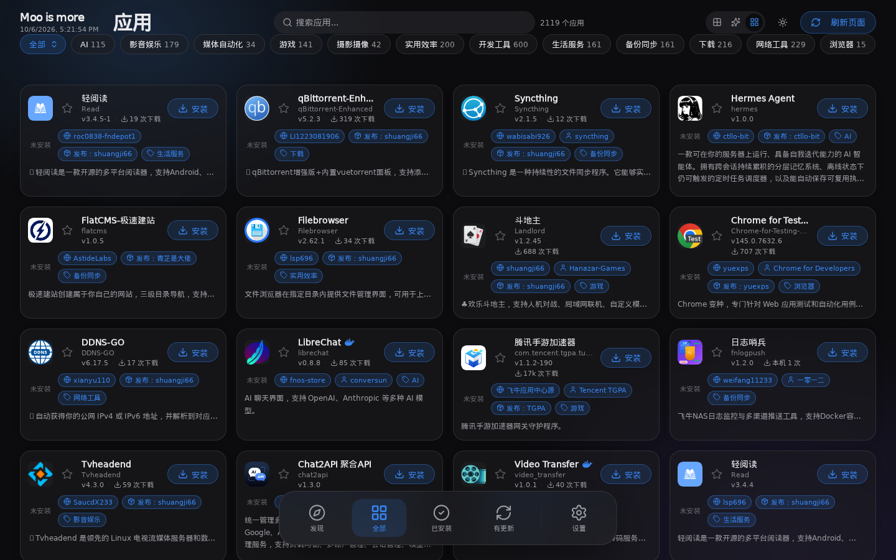

顶部一根**搜索框**（应用名、标识、描述都能搜），一排**自动归类**的分类 chips（AI / 影音娱乐 / 媒体自动化 / 游戏 / 摄影摄像 / 实用效率 / 开发工具 / 生活服务 / 备份同步 / 下载 / 网络工具 / 浏览器……每个带数量角标），加上**排序**（下载量 / 更新时间 / 名称等）。桌面端这行分类胶囊**随滚动冻结**在顶栏，长列表滚到哪里分类都能点。

搜索体验示例——搜「moo」时结果页：

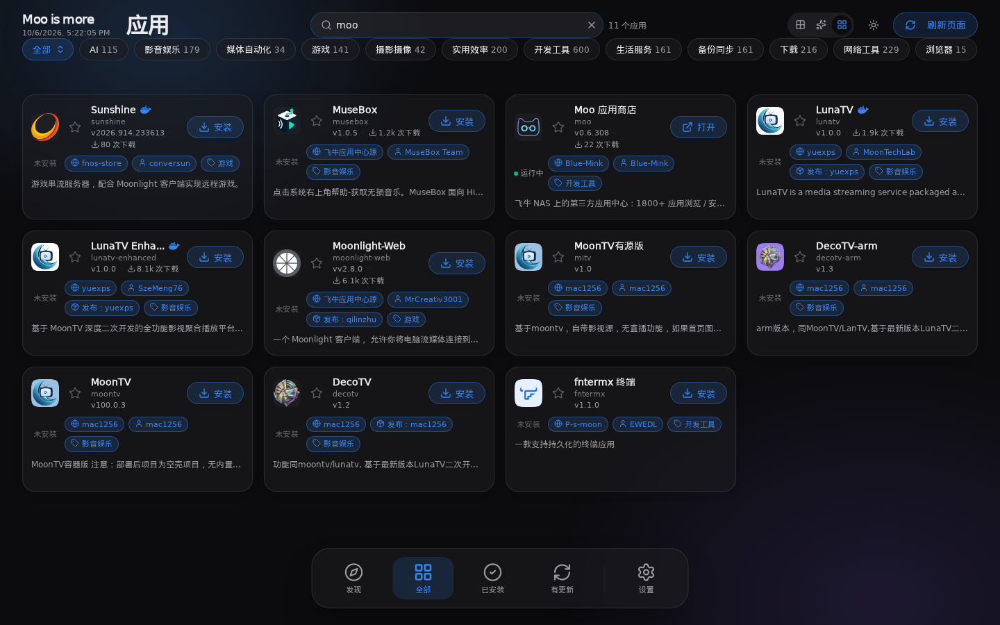

每张应用卡片包含：**图标、显示名、应用标识(appname)、版本号、下载量、来源徽章、作者、分发者、一句话简介、状态（未安装/已安装）、动作按钮（安装/打开）**。

两个细节值得说：

1. **来源徽章**（卡片上蓝色的 `moo.json`/`kspeeder`/`飞牛应用中心源` 标签）：告诉你这个应用来自哪个源，`✓` 表示可信源；
2. **多源合并**：同一个应用如果三个源都收录，目录里只出现**一张卡**，版本取各源最高的；点开详情能看到它实际来自哪里。不会出现装完 A 源、B 源又让你装一遍的情况。

## 四、已安装 & 有更新

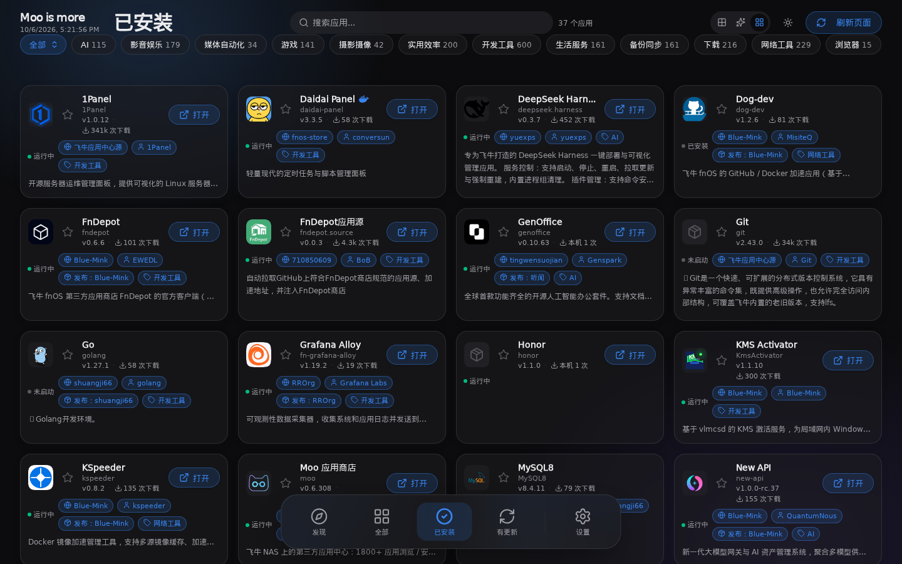

「已安装」把全量目录过滤成本机视图，装了的一律给「打开」按钮，配合搜索就是你的**本机应用管理页**。

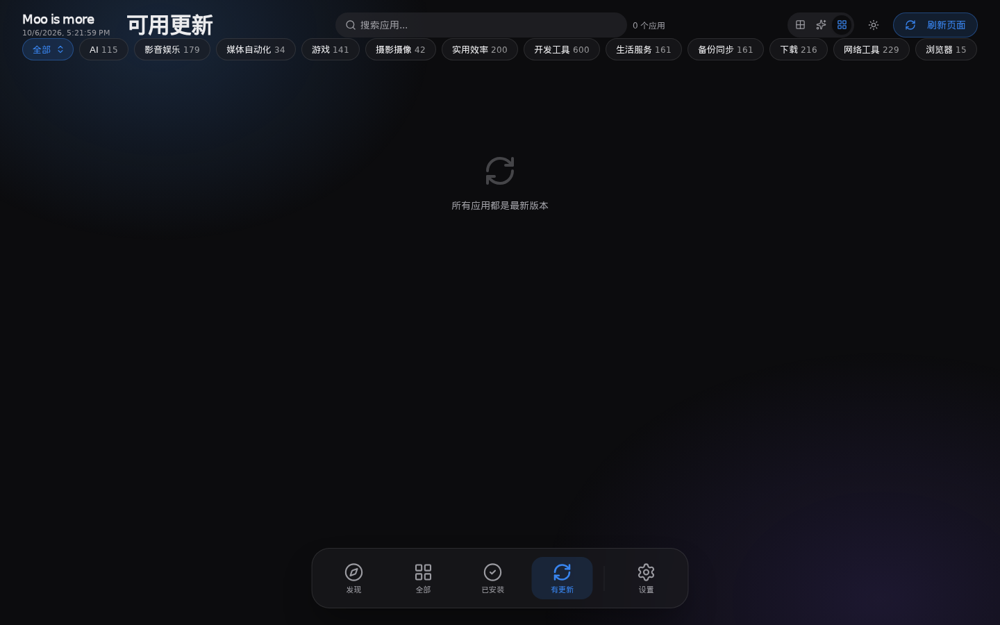

「有更新」是 Moo 的核心价值页：后台按设置间隔（默认 1 小时）自动刷新全部 157 个源的目录并比对已装版本，有新版本就出现在这里 + Dock 角标计数。全部最新时就是上图干干净净的「所有应用都是最新版本」。**点更新的逻辑和官方商店一致：Moo 拉取对应版本 FPK（走加速源），交给飞牛应用中心完成安装/升级，全程不用你找下载地址。**

---

## 五、应用详情页

任意卡片点进去就是详情弹窗（桌面端双击卡片，手机端点按；下图是 Moo 看自己，dogfood 😄）：

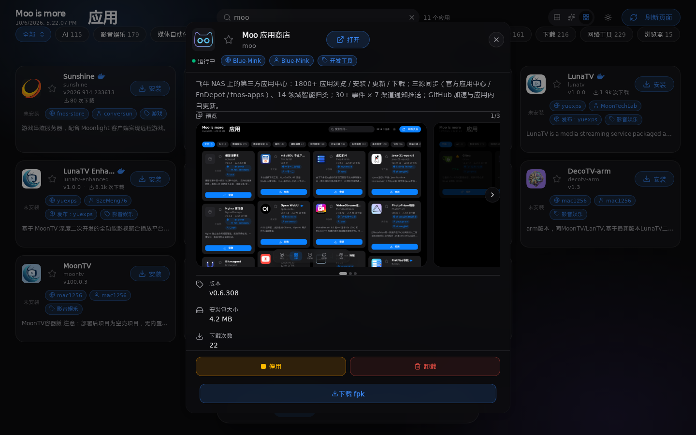

从上到下：**运行状态徽标**（运行中/未安装）→ 收藏星标 → 来源 / 作者 / 分类徽章 → 完整简介 → **预览图轮播**（源作者提供的截图）→ 操作区（**打开 / 停用 / 卸载 / 下载 fpk / 安装 / 更新**，按应用状态自动切换，全部是磨砂浅蓝胶囊按钮）→ README 渲染 → **更新日志小框**。弹窗本身是玻璃化设计：半透明底 + 背景虚化，遮罩压暗不压死，列表隐约可见有景深。

「下载 fpk」这个按钮很实用：只想要安装包不想装的，直接下 FPK 原件（带 sha256 校验），自己留档或离线装别的机器。

往下滚是版本与更新日志区块：

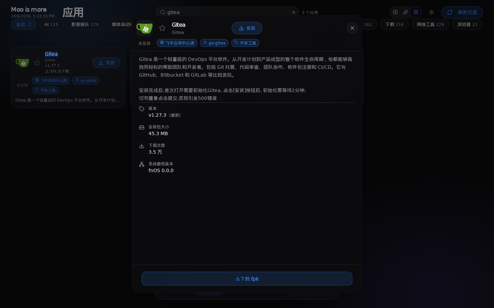

## 六、安装流程与向导

点「安装」后，如果这个 FPK 带安装向导（比如要配端口的应用），Moo 会先把参数收集齐再动手：

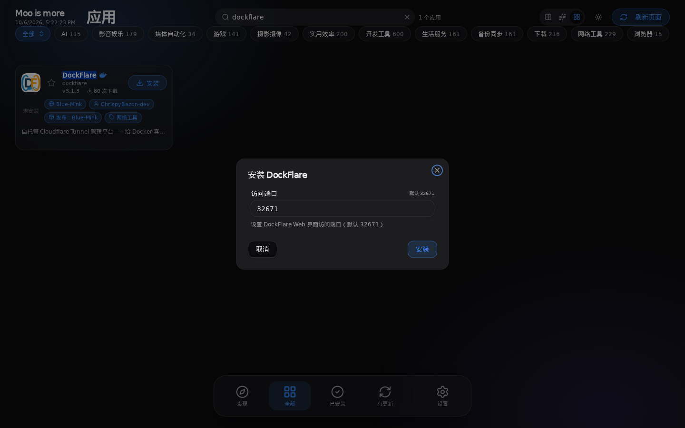

上图是「DockFlare」的端口向导——默认值、说明文案、校验都在向导里，跟飞牛原生安装向导一致。Moo 自身作为应用也走这套（首次安装要确认开源许可 + 配访问端口 + 下载/日志目录）。

参数确认 → Moo 从 Release 下载 FPK（国内网络自动走 GitHub 加速源，见下节）→ 校验 sha256 → 提交给飞牛应用中心安装 → 完成后卡片状态变「已安装」。

---

## 七、设置页（七个 tab 逐个说）

点 Dock 的「设置」进入。右上角常驻当前版本号。

### 7.1 系统设置

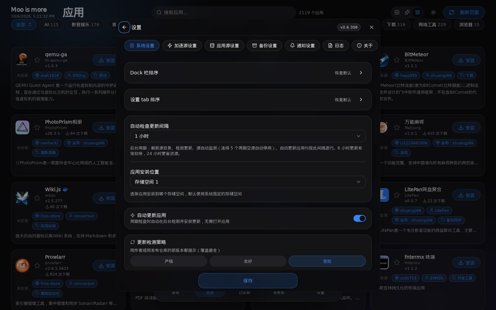

- **Dock 栏排序 / 设置 tab 排序**：五个 Dock 按钮和七个设置 tab 都能拖拽自定义顺序，一键恢复默认；
- **自动检查更新间隔**：全源目录刷新 + 更新检测 + 源健康监测的后台周期（默认 1 小时，6 小时更新发现较快、24 小时更省资源）；
- **应用安装位置**：装应用时选哪个存储空间。

### 7.2 加速源设置（国内访问 GitHub 的救星）

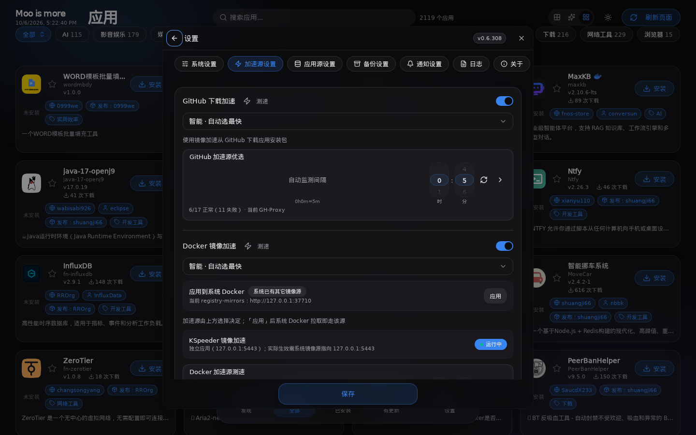

- **GitHub 下载加速**：开关 + 模式（默认「智能·自动选最快」）+ **加速源优选列表** + 一键**测速** + **自动监测间隔**（定期测活）。下载 FPK、拉取源索引都会自动走当前最快线路；
- **Docker 镜像加速**：内置镜像源优选，还可以**一键应用到系统 Docker**——Moo 会先备份 `daemon.json` 再合并写入 `registry-mirrors` 并重启 Docker 验证，失败自动回滚，改坏了也不会把 Docker 弄死。

### 7.3 应用源设置

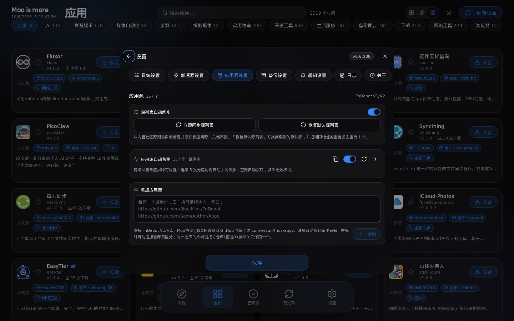

- 顶部统计当前 **157 个应用源**；
- **源列表自动同步**：从内置社区列表自动发现新源（只增不删），可「立即同步源列表」，可「恢复默认源列表」（找回误删的默认源 + 相同地址去重）；
- **应用源自动监测**：持续探测各源可用性，连续 5 次拉不到应用的空源自动停用沉底，不拖慢整体刷新；
- **添加应用源**：一个输入框，**一行一个地址，支持批量粘贴**。直接填仓库链接就行（`https://github.com/作者/仓库`），Moo 自动识别协议并抓取索引（详见第八章协议说明）；同仓库不同链接自动判重，重名源自动用仓库名区分。

---

### 7.4 备份设置

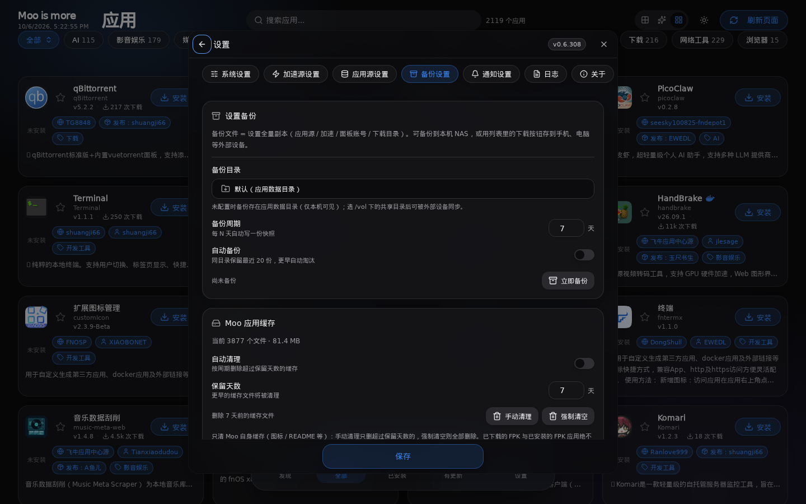

设置全量副本（**应用源 / 加速源 / 面板账号 / 下载目录**）一键打包：备份到 NAS 本机（默认应用数据目录，也可选 `/vol1` 下共享目录方便外部设备同步）、或列表里点下载存到手机电脑。支持自动备份（每 N 天快照，同目录保留最近 20 份自动淘汰）。下方还有 **Moo 应用缓存**占用统计，清缓存不丢配置。

### 7.5 通知设置

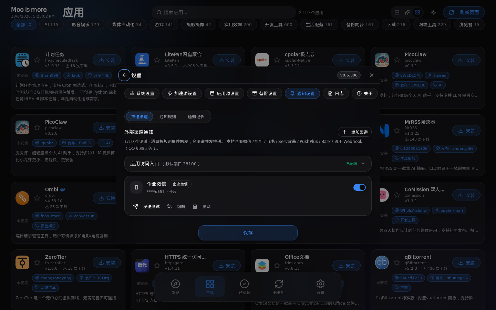

三个子 tab：**推送渠道 / 通知规则 / 通知记录**。

- 支持 **7 类外部渠道**：企业微信、钉钉、飞书、Server酱、PushPlus、Bark、通用 Webhook（QQ 机器人等）；
- 每个渠道卡片带启停开关、**发送测试**、编辑、删除；
- **通知规则**：按事件（应用更新 / 更新安装结果 / 源变化等）× 渠道组合订阅；
- 通知样式是排版过的卡片/Markdown（按渠道能力自动降级），标识符都会转成可读名称；
- 「应用访问入口」（默认端口 38100）会出现在通知里，手机上点通知直达 Moo。

### 7.6 日志

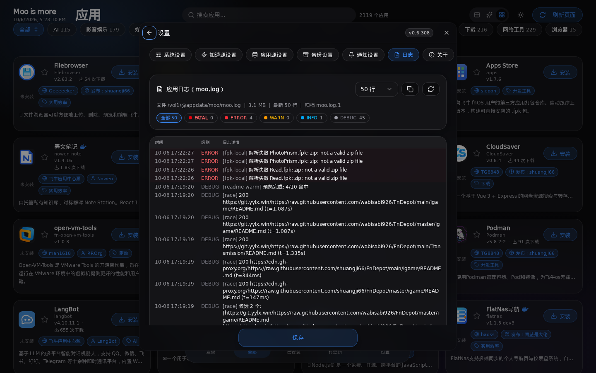

应用内直接看 `moo.log`（不用 SSH）：行数选择、**级别过滤**（FATAL / ERROR / WARN / INFO / DEBUG 带计数 chips）、一键复制、手动刷新；日志文件自动轮转。排查「某个源为什么没更新」时非常好用。

### 7.7 关于

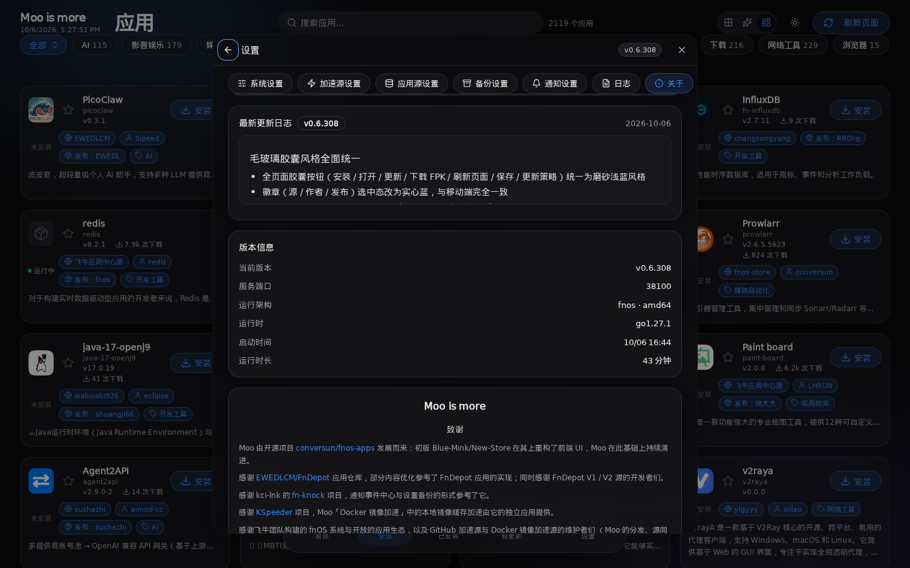

版本、项目主页、运行架构、服务端口、运行时、启动时间与运行时长、开源致谢。下方还有「**最新更新日志**」卡片——跟随最新版本的日志（当前构建的发布说明随包内嵌，源里有更新版本时预览最新版日志），用 README 同款渲染器展示，卡内可滚动，不离开应用就知道这版改了什么。

---

## 八、Moo 源协议（moo.json）：把你的 GitHub 仓库变成应用源

这是 Moo 最好玩的部分：**协议完全开放**。你只要有一个 GitHub 仓库，放一个 `moo.json`（或 `fnpack.json`，兼容 FnDepot V2），别人在 Moo 里贴你的仓库链接就能安装你的应用——不需要注册、不需要审核、不需要服务器。

### 最小心智模型

```
你的仓库
├── moo.json          ← 索引（入口）
├── xxx/ICON.PNG      ← 图标、README、预览图（仓库内静态文件，索引用相对路径引用）
└── Releases          ← FPK 安装包挂在这里
```

### 索引结构（v2）

```json
{
  "schema_version": "2",
  "source_info": {
    "name": "Blue-Mink 应用源",
    "author": "Blue-Mink",
    "homepage": "https://github.com/Blue-Mink/FnDepot",
    "description": "一句话介绍这个源"
  },
  "apps": {
    "moo": {
      "display_name": "Moo 应用商店",
      "desc": "飞牛 NAS 上的第三方应用中心……",
      "icon_url": "moo/ICON.PNG",
      "preview_urls": ["moo/Preview/1.png"],
      "readme_url": "moo/README.md",
      "categories": ["开发工具"],
      "maintainer": "Blue-Mink",
      "distributor": "Blue-Mink",
      "install_type": "root",
      "is_docker": false,
      "releases": {
        "0.6.308": {
          "updated_at": "2026-10-06T17:00:00+08:00",
          "changelog": "• 新增……\n• 修复……",
          "packages": {
            "x86": {
              "download_url": "https://github.com/Blue-Mink/moo/releases/download/v0.6.308/moo_0.6.308_x86.fpk",
              "sha256": "7c17a97c……",
              "size": 4654662
            },
            "arm": {
              "download_url": "https://github.com/Blue-Mink/moo/releases/download/v0.6.308/moo_0.6.308_arm.fpk",
              "sha256": "07b5537c……",
              "size": 4238186
            }
          }
        }
      }
    }
  }
}
```

要点：

- **`apps` 的 key = FPK manifest 里的 `appname`**（不是随便起的展示名），这是多源合并的身份证；
- **`releases` 可以同时挂多个历史版本**，Moo 按版本号取最新做更新判定，详情页可以选版本下载；
- **`packages` 按架构区分 `x86` / `arm`**，装的时候按你 NAS 的架构自动选；
- **`sha256` 强烈建议写**：Moo 下载完会校验，不匹配直接拒装，防下载截断也防包被换；
- `icon_url / preview_urls / readme_url` 支持相对路径（相对索引文件所在目录）和绝对 URL 两种写法；
- 添加源时**贴仓库地址或索引直链都行**，GitHub / raw / jsDelivr / 镜像 / Gitea raw 等形态的链接会自动归一成同一个源地址（同一仓库反复贴不会重复入库）。

### 现有可一键添加的源示例

```
https://github.com/Blue-Mink/FnDepot        ← 本文作者维护（14 应用多版本）
https://github.com/EWEDLCM/FnDepot          ← FnDepot 官方仓库（同时兼容 FnDepot V1/V2 与 Moo 协议）
```

conversun / fnos-apps 的 feed 地址同样直接贴。三种协议（FnDepot、Moo、fnos-apps）Moo 都认识，自动嗅探。

---

## 九、常见问题（FAQ）

**Q1：浏览器直接开 `http://NAS_IP:38100`，打开设置提示「需通过面板网关入口（管理员身份）」？**
设计如此。裸端口是调试入口，只出不进（不接收管理操作），管理请走**飞牛桌面的 Moo 图标**，走面板登录态自动就是管理员。这样即使端口被误暴露，也改不了你的配置。

**Q2：官方应用中心的应用怎么没同步进来？**
「设置 → 应用源」里飞牛官方源首次使用需要点一次授权（无头授权，不需要你输面板密码），授权后官方目录（380+ 应用及下载量）和其他源一起进目录。

**Q3：GitHub 下载慢 / 失败？**
「加速源设置」保持开启即可，Moo 会在十几个镜像里自动测速选最快，还能定时自动监测。遇到某个加速源挂了会自动切下一个。

**Q4：通知推不出去？**
先用渠道卡片里的「发送测试」定位；企业微信机器人有 20 条/分钟限流，多渠道连发可能被丢。

**Q5：会不会拖慢 NAS？**
后台巡检默认 1 小时一次、按源增量拉 JSON 索引，图标/预览全部本机缓存（可看占用、可清理），实测日常资源占用可以忽略。

**Q6：数据在哪？会不会外传？**
所有配置、缓存都在 NAS 本机 `/vol1/@appdata/moo/`，应用中心侧仅访问飞牛官方接口和你在「应用源」里主动添加的地址。

---

## 十、下载与反馈

- **GitHub**：`https://github.com/Blue-Mink/moo`（Releases 下载最新 FPK，x86 / arm 双架构；Issues 提 bug / 求收录，应用诊断弹窗也带一键上报）
- **加源体验**：Moo 内「设置 → 应用源 → 添加」贴 `https://github.com/Blue-Mink/FnDepot` 即可看到本文同款应用列表
- 版本更新日志在应用内「设置 → 关于 → 最新更新日志」和 GitHub Release 都有

Moo is more —— 希望大家用得顺手。有问题欢迎到 GitHub Issues 或飞牛论坛回帖，看到都会回。
